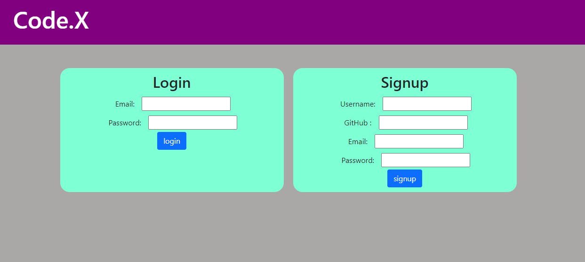
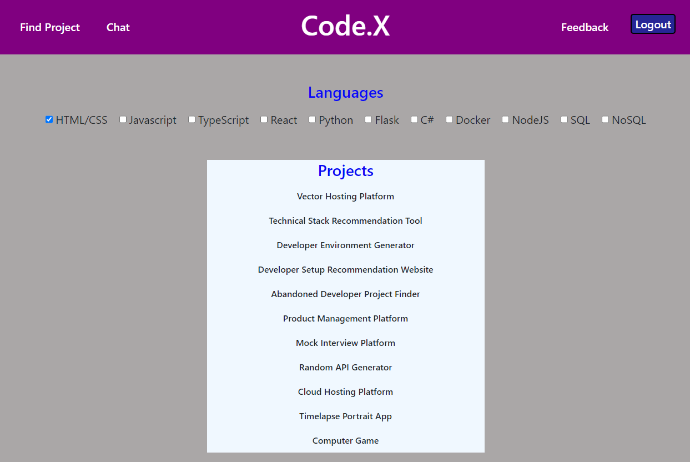
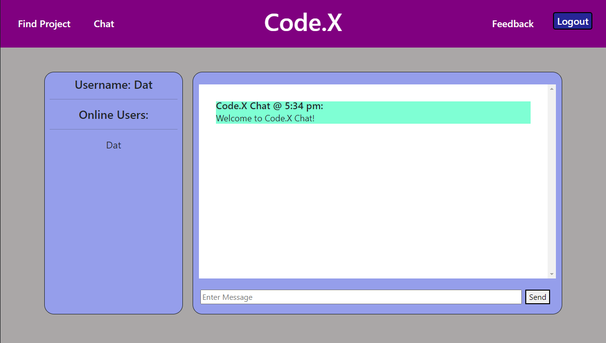
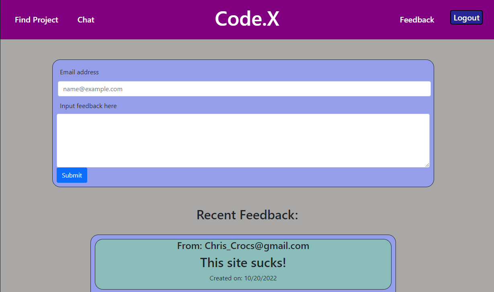

# Code.X

## Description
As a new aspiring full stack web developer, I often struggle to think of what to do next.  What should my next project be?  What can I even do with the languages and technologies I know so far?  Code.X is here to answer your questions!  

## Link to Website
https://boiling-reef-34028.herokuapp.com/

## Technologies Used
* HTML/ CSS/ Javascript
* Node.js
* Heroku
* Bcrypt Package
* Dotenv Package
* Express Package 
* Express-Handlebars Package
* Express-Session Package
* MySQL Package
* Sequelize Package
* Socket.IO

## Team Members
* [Ashley Yu](https://github.com/hiashley)
* [James Li](https://github.com/JimJamLee)
* [Jayden Trinh](https://github.com/jaydenprime)
* [Dat Nguyen](https://github.com/Crestatic)

## Presentation Slides
https://docs.google.com/presentation/d/1_CvYh84f7wJ9gB7ytG898170LJrM5nmEIAlQItGaTwc/edit#slide=id.g320332ed93_1_0

## Screenshots
### Login Page

### Find Project Page

### Chat Page

### Feedback Page
